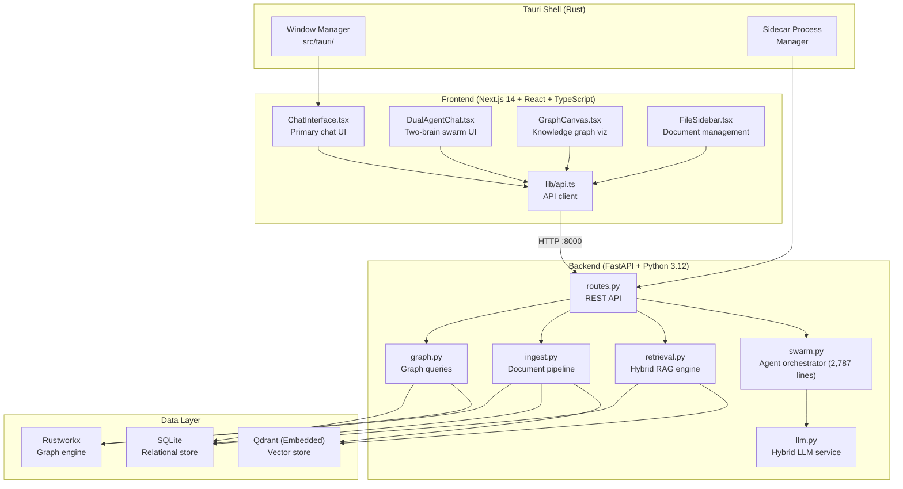
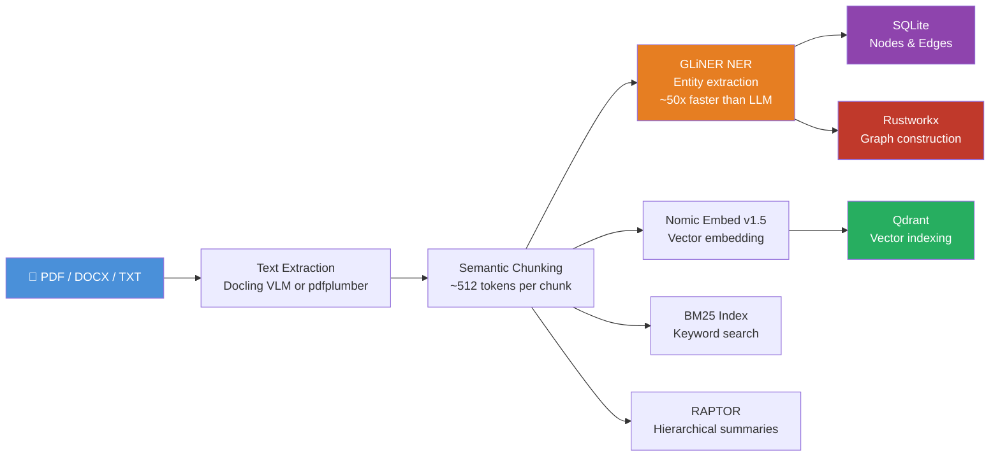
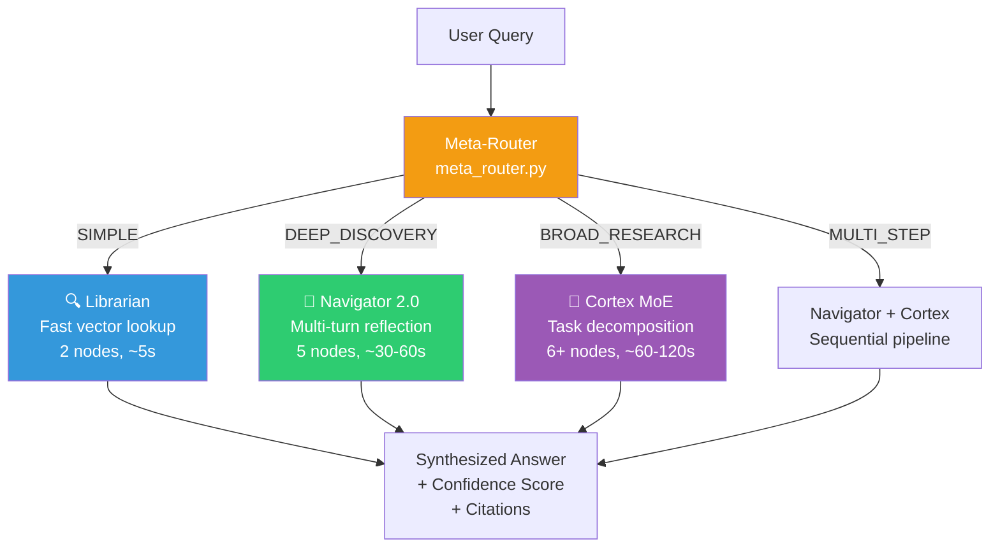
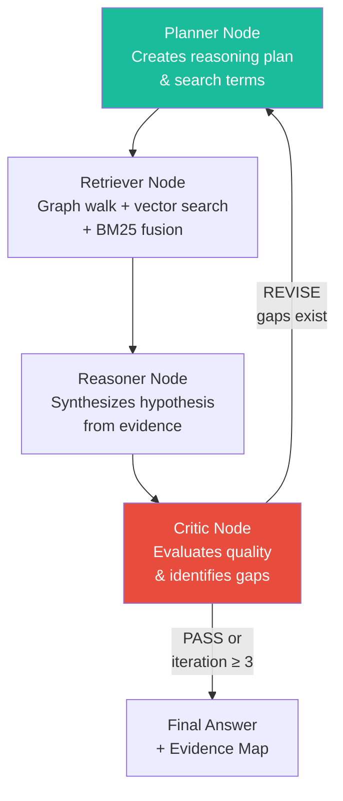
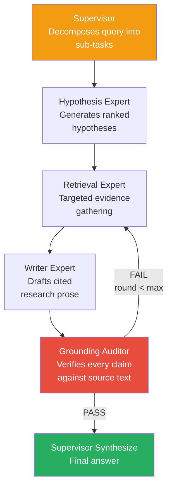
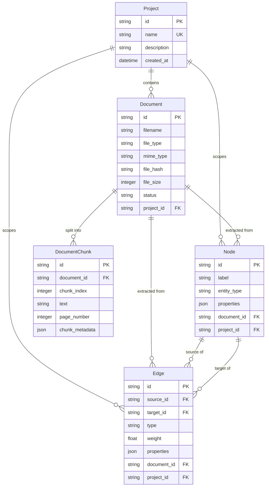
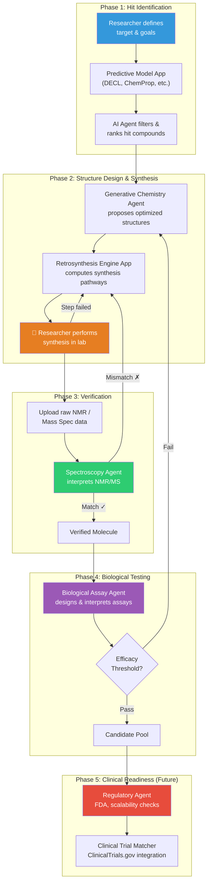
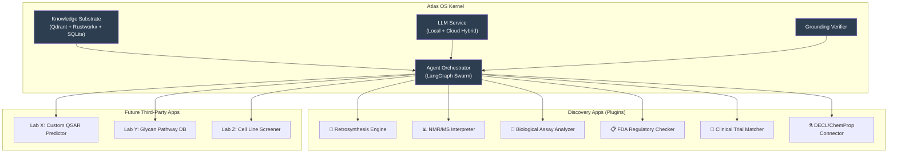
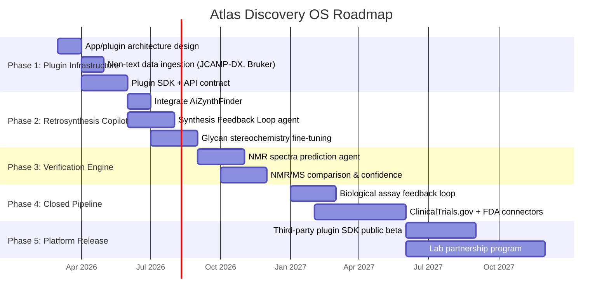

# Atlas — Technical Architecture & Discovery OS Vision

> **"The AI does not know things. It queries a living knowledge substrate… and reasons over it automatically."**

**Version:** 1.0.0 | **Date:** February 2026 | **Status:** Production-Ready Core, Discovery Vision in Design

---

## Table of Contents

1. [System Overview](#1-system-overview)
2. [Architecture Deep-Dive](#2-architecture-deep-dive)
3. [The Knowledge Pipeline](#3-the-knowledge-pipeline)
4. [The Multi-Agent Swarm](#4-the-multi-agent-swarm)
5. [Hardware Optimization & Constraints](#5-hardware-optimization--constraints)
6. [Data Model & Storage](#6-data-model--storage)
7. [Configuration & Extensibility](#7-configuration--extensibility)
8. [The Vision: Discovery OS for Small Molecule & Glycan Research](#8-the-vision-discovery-os-for-small-molecule--glycan-research)
9. [Critical Feasibility Analysis](#9-critical-feasibility-analysis)
10. [Roadmap](#10-roadmap)

---

## 1. System Overview

Atlas is a **standalone Windows desktop application** that constructs a continuous, queryable knowledge layer beneath an AI model. It is not a chatbot—it is a local-first, agentic research operating system.

The application is fully self-contained: no cloud accounts, no external databases, no Docker. A single `.msi` installer bundles the entire stack.

### What Atlas Does Today

| Capability | Implementation |
|---|---|
| **Document Ingestion** | PDF, DOCX, TXT → text extraction → semantic chunking → entity extraction → vector embedding |
| **Hybrid RAG** | Vector search (Qdrant) + BM25 keyword search + Knowledge Graph traversal, fused via Reciprocal Rank Fusion |
| **Multi-Agent Reasoning** | LangGraph-orchestrated swarm with intent routing, reflection loops, and MoE task decomposition |
| **Anti-Hallucination** | Grounding Verifier audits every factual claim against source text with tiered confidence badges |
| **Knowledge Graph** | Rustworkx-backed entity-relationship graph with centrality analysis and subgraph extraction |
| **Local Inference** | `llama-cpp-python` running quantized GGUF models on consumer GPUs (4–8 GB VRAM) |
| **Cloud Hybrid** | Optional API fallback to DeepSeek, MiniMax, OpenAI, or Anthropic via LiteLLM |

---

## 2. Architecture Deep-Dive

### 2.1 Three-Layer Desktop Stack

Atlas is a Tauri desktop app wrapping a Next.js frontend and a Python FastAPI backend. All three run as local processes; no network egress is required.



### 2.2 Key File Map

| Layer | File | Purpose | Size |
|---|---|---|---|
| Backend Core | [swarm.py](file:///c:/Users/aidan/OneDrive%20-%20Duke%20University/Code/ContAInnum_Atlas2.0_backup_20260124_181415/src/backend/app/services/swarm.py) | Full agent orchestration: Navigator, Navigator 2.0, Cortex, routing | 2,787 lines |
| Backend Core | [llm.py](file:///c:/Users/aidan/OneDrive%20-%20Duke%20University/Code/ContAInnum_Atlas2.0_backup_20260124_181415/src/backend/app/services/llm.py) | Hybrid LLM: local GGUF + cloud API via LiteLLM, CUDA DLL management | 1,116 lines |
| Backend Core | [retrieval.py](file:///c:/Users/aidan/OneDrive%20-%20Duke%20University/Code/ContAInnum_Atlas2.0_backup_20260124_181415/src/backend/app/services/retrieval.py) | Hybrid RAG: vector + BM25 + graph, Reciprocal Rank Fusion | 494 lines |
| Backend Core | [ingest.py](file:///c:/Users/aidan/OneDrive%20-%20Duke%20University/Code/ContAInnum_Atlas2.0_backup_20260124_181415/src/backend/app/services/ingest.py) | Document pipeline: extraction → chunking → GLiNER NER → embedding | 1,190 lines |
| Agents | [meta_router.py](file:///c:/Users/aidan/OneDrive%20-%20Duke%20University/Code/ContAInnum_Atlas2.0_backup_20260124_181415/src/backend/app/services/agents/meta_router.py) | Intent classification (SIMPLE/DEEP/BROAD/MULTI_STEP) + model swapping | 101 lines |
| Agents | [librarian.py](file:///c:/Users/aidan/OneDrive%20-%20Duke%20University/Code/ContAInnum_Atlas2.0_backup_20260124_181415/src/backend/app/services/agents/librarian.py) | Fast 2-node graph: Retrieve → Answer. Handles ~80% of queries in <5s | 216 lines |
| Agents | [supervisor.py](file:///c:/Users/aidan/OneDrive%20-%20Duke%20University/Code/ContAInnum_Atlas2.0_backup_20260124_181415/src/backend/app/services/agents/supervisor.py) | MoE Supervisor: decomposes queries, delegates to experts, audits drafts | 372 lines |
| Agents | [grounding.py](file:///c:/Users/aidan/OneDrive%20-%20Duke%20University/Code/ContAInnum_Atlas2.0_backup_20260124_181415/src/backend/app/services/agents/grounding.py) | Anti-hallucination: extracts claims → verifies each against source text | 161 lines |
| Experts | [hypothesis.py](file:///c:/Users/aidan/OneDrive%20-%20Duke%20University/Code/ContAInnum_Atlas2.0_backup_20260124_181415/src/backend/app/services/agents/experts/hypothesis.py) | Generates ranked hypotheses from evidence | — |
| Experts | [retrieval_expert.py](file:///c:/Users/aidan/OneDrive%20-%20Duke%20University/Code/ContAInnum_Atlas2.0_backup_20260124_181415/src/backend/app/services/agents/experts/retrieval_expert.py) | Targeted evidence gathering per sub-task | — |
| Experts | [writer.py](file:///c:/Users/aidan/OneDrive%20-%20Duke%20University/Code/ContAInnum_Atlas2.0_backup_20260124_181415/src/backend/app/services/agents/experts/writer.py) | Drafts cited research prose from evidence | — |
| Experts | [critic.py](file:///c:/Users/aidan/OneDrive%20-%20Duke%20University/Code/ContAInnum_Atlas2.0_backup_20260124_181415/src/backend/app/services/agents/experts/critic.py) | Reviews and critiques drafts for logical gaps | — |
| Config | [config.py](file:///c:/Users/aidan/OneDrive%20-%20Duke%20University/Code/ContAInnum_Atlas2.0_backup_20260124_181415/src/backend/app/core/config.py) | 50+ tunable parameters (reflection iterations, chunk sizes, MoE rounds, etc.) | 129 lines |
| Database | [database.py](file:///c:/Users/aidan/OneDrive%20-%20Duke%20University/Code/ContAInnum_Atlas2.0_backup_20260124_181415/src/backend/app/core/database.py) | SQLAlchemy ORM: `Project`, `Document`, `DocumentChunk`, `Node`, `Edge` | 266 lines |

---

## 3. The Knowledge Pipeline

When a user uploads a document, Atlas runs a multi-stage ingestion pipeline defined in [ingest.py](file:///c:/Users/aidan/OneDrive%20-%20Duke%20University/Code/ContAInnum_Atlas2.0_backup_20260124_181415/src/backend/app/services/ingest.py):



**Key implementation details:**

- **Text Extraction:** Tries Docling VLM first for structure-preserving extraction (tables, charts), falls back to `pdfplumber`/`PyPDF` (`_extract_pdf_text` in `ingest.py`)
- **Chunking:** Uses semantic chunking via [semantic_chunker.py](file:///c:/Users/aidan/OneDrive%20-%20Duke%20University/Code/ContAInnum_Atlas2.0_backup_20260124_181415/src/backend/app/services/semantic_chunker.py) (target: 512 tokens), falls back to fixed-size overlap (1000 chars, 200 overlap)
- **Entity Extraction:** GLiNER (`gliner_small-v2.1`, ~50 MB) extracts typed entities (PERSON, ORGANIZATION, CONCEPT, etc.) without requiring an LLM call, via `_extract_entities_gliner`
- **RAPTOR:** [raptor.py](file:///c:/Users/aidan/OneDrive%20-%20Duke%20University/Code/ContAInnum_Atlas2.0_backup_20260124_181415/src/backend/app/services/raptor.py) generates hierarchical cluster summaries (L1 clusters) for each document, enabling multi-resolution retrieval
- **BM25:** [bm25_index.py](file:///c:/Users/aidan/OneDrive%20-%20Duke%20University/Code/ContAInnum_Atlas2.0_backup_20260124_181415/src/backend/app/services/bm25_index.py) maintains a sparse keyword index fused with vector results via Reciprocal Rank Fusion (`rrf_fuse`)

---

## 4. The Multi-Agent Swarm

The core intelligence lives in [swarm.py](file:///c:/Users/aidan/OneDrive%20-%20Duke%20University/Code/ContAInnum_Atlas2.0_backup_20260124_181415/src/backend/app/services/swarm.py) (2,787 lines), orchestrated via LangGraph `StateGraph` objects.

### 4.1 Query Routing



The `Meta-Router` ([meta_router.py](file:///c:/Users/aidan/OneDrive%20-%20Duke%20University/Code/ContAInnum_Atlas2.0_backup_20260124_181415/src/backend/app/services/agents/meta_router.py)) classifies each query using a zero-shot LLM classification prompt and also performs **dynamic model swapping** — selecting faster 3B models for simple queries and larger 7B–8B models for deep discovery tasks via `ensure_optimal_model`.

### 4.2 Librarian Agent (Fast Path)

Defined in [librarian.py](file:///c:/Users/aidan/OneDrive%20-%20Duke%20University/Code/ContAInnum_Atlas2.0_backup_20260124_181415/src/backend/app/services/agents/librarian.py). A minimal 2-node LangGraph:

```
retrieve_node → answer_node → END
```

- **Retrieve:** Vector search via Qdrant `query_points` → optional FlashRank reranking → cosine threshold filtering (≥0.4 for vector, ≥0.05 for reranked)
- **Answer:** Single LLM call with XML-structured output (`<reasoning>`, `<confidence>`, `<answer>` tags)
- Handles **~80% of queries** in under 5 seconds

### 4.3 Navigator 2.0 (Deep Discovery with Reflection)

The Navigator implements multi-turn reflection loops (up to `MAX_REFLECTION_ITERATIONS=3`). Its LangGraph contains 5 nodes:



**State tracked per iteration** (from `NavigatorState` in `swarm.py`):
- `reasoning_plan`, `identified_gaps`, `search_terms` — The Planner's output
- `graph_summary` — Rustworkx subgraph centrality analysis
- `accumulated_evidence` — Grows across reflection iterations
- `confidence_score` — Auto-passes at ≥0.75 threshold (`NAVIGATOR_CONFIDENCE_THRESHOLD`)
- `iteration_count` — Capped at 3 to prevent infinite loops

### 4.4 Cortex MoE (Mixture of Experts)

For broad research queries, the Cortex decomposes the question into sub-tasks and delegates to specialized experts. Built in [supervisor.py](file:///c:/Users/aidan/OneDrive%20-%20Duke%20University/Code/ContAInnum_Atlas2.0_backup_20260124_181415/src/backend/app/services/agents/supervisor.py):



**MoE State** (`MoEState` in `supervisor.py`) tracks:
- `sub_tasks` — Decomposed sub-queries (default: 5 via `CORTEX_NUM_SUBTASKS`)
- `hypotheses` and `selected_hypothesis` — Ranked by the Hypothesis Expert
- `draft` and `draft_version` — Iterative drafting by the Writer Expert
- `grounding_results`, `ungrounded_claims`, `audit_verdict` — From the Grounding Auditor
- `max_rounds` — Capped at 5 (`MOE_MAX_EXPERT_ROUNDS`)

### 4.5 Grounding Verifier (Anti-Hallucination)

Defined in [grounding.py](file:///c:/Users/aidan/OneDrive%20-%20Duke%20University/Code/ContAInnum_Atlas2.0_backup_20260124_181415/src/backend/app/services/agents/grounding.py). Every factual claim in an agent's output is individually checked:

1. **Claim Extraction:** LLM call decomposes the answer into numbered factual claims
2. **Per-Claim Verification:** Each claim is embedded and searched against Qdrant; cosine similarity determines badge level:
   - `GROUNDED` (score > 0.82) — Directly supported by cited source
   - `SUPPORTED` (0.72–0.82) — Paraphrased but source matches
   - `INFERRED` (0.60–0.72) — Synthesis/inference, not verbatim in source
   - `UNVERIFIED` (< 0.60) — No matching source found
3. **Overall Score:** Percentage of claims that are `GROUNDED` or `SUPPORTED`

---

## 5. Hardware Optimization & Constraints

Atlas targets the **NVIDIA RTX 3050 (4 GB VRAM)** as the minimum hardware. Every architectural decision flows from this constraint:

| Technique | Implementation | Why it Matters |
|---|---|---|
| **Sequential Agent Execution** | LangGraph nodes run serially | Only one LLM inference at a time; never exceeds VRAM |
| **GBNF Grammar Constraints** | `generate_with_validation` in `swarm.py` | Forces small 3B–7B models to output valid JSON/XML without fine-tuning |
| **Dynamic Model Swapping** | `ensure_optimal_model` in `meta_router.py` | Uses fast 3B models for simple queries, 7B+ for complex ones |
| **Partial GPU Offload** | `DEFAULT_GPU_LAYERS = 35` in `llm.py` | Offloads ~3.2 GB to GPU, keeps rest in RAM; tunable via env var |
| **GLiNER NER** | `_extract_entities_gliner` in `ingest.py` | ~50x faster than LLM-based extraction, ~50 MB model footprint |
| **Rustworkx over NetworkX** | `get_rustworkx_subgraph` in `graph.py` | C/Rust graph math is orders of magnitude faster than pure Python |
| **Embedded Qdrant** | In-process path mode (no separate server) | Zero network overhead, single-process memory management |
| **Prompt Templates** | [prompt_templates.py](file:///c:/Users/aidan/OneDrive%20-%20Duke%20University/Code/ContAInnum_Atlas2.0_backup_20260124_181415/src/backend/app/services/prompt_templates.py) (750 lines) | Few-shot examples tuned per node reduce hallucination in small models |

### LLM Configuration (from [config.py](file:///c:/Users/aidan/OneDrive%20-%20Duke%20University/Code/ContAInnum_Atlas2.0_backup_20260124_181415/src/backend/app/core/config.py)):
```
LLM_CONTEXT_SIZE    = 8192    # 8K context window (4096 for 3B if OOM)
LLM_N_BATCH         = 512     # Batch size for prompt processing
LLM_USE_MLOCK       = True    # Pin model weights in RAM
DEFAULT_GPU_LAYERS   = 35     # Partial VRAM offload
```

---

## 6. Data Model & Storage

All persistence is defined in [database.py](file:///c:/Users/aidan/OneDrive%20-%20Duke%20University/Code/ContAInnum_Atlas2.0_backup_20260124_181415/src/backend/app/core/database.py):



**Key indexes** (performance-critical):
- `idx_nodes_label` — Fast entity lookup by type
- `idx_edges_source_target` — Graph traversal queries
- `idx_documents_file_hash` — Deduplication on upload
- `idx_chunk_document` — Chunk retrieval by document

**Graph edge ontology** (from `GRAPH_ONTOLOGY_EDGE_TYPES` in config):
```
CAUSES, INHIBITS, ENABLES, PART_OF, RELATED_TO, CONTRADICTS,
SUPPORTS, CLINICAL_TRIAL_FOR, TREATS, DIAGNOSES, MEASURED_BY,
AUTHORED_BY, PUBLISHED_IN, FUNDED_BY
```

> [!NOTE]
> The edge types `CLINICAL_TRIAL_FOR`, `TREATS`, and `DIAGNOSES` are already built into the ontology — the codebase was designed with biomedical discovery in mind from day one.

---

## 7. Configuration & Extensibility

All 50+ parameters are defined in a single `Settings` class in [config.py](file:///c:/Users/aidan/OneDrive%20-%20Duke%20University/Code/ContAInnum_Atlas2.0_backup_20260124_181415/src/backend/app/core/config.py), loaded from `.env`:

| Category | Parameters | Defaults |
|---|---|---|
| **Navigator Reflection** | `ENABLE_NAVIGATOR_REFLECTION`, `MAX_REFLECTION_ITERATIONS`, `NAVIGATOR_CONFIDENCE_THRESHOLD` | `True`, `3`, `0.75` |
| **Cortex MoE** | `ENABLE_CORTEX_CROSSCHECK`, `CORTEX_NUM_SUBTASKS`, `MOE_MAX_EXPERT_ROUNDS`, `MOE_HYPOTHESIS_COUNT` | `True`, `5`, `5`, `3` |
| **RAG Pipeline** | `ENABLE_RERANKING`, `RERANK_TOP_N`, `USE_SEMANTIC_CHUNKING`, `USE_RAPTOR` | `True`, `5`, `True`, `True` |
| **Document Parsing** | `USE_DOCLING`, `CHUNK_SIZE`, `CHUNK_OVERLAP`, `SEMANTIC_CHUNK_TOKENS` | `True`, `1000`, `200`, `512` |
| **Graph** | `ENABLE_EVIDENCE_BOUND_EXTRACTION`, `ENABLE_GRAPH_CRITIC`, `GRAPH_CACHE_TTL` | `True`, `True`, `300s` |
| **Cloud Models** | `DEEPSEEK_API_KEY`, `MINIMAX_API_KEY`, `OPENAI_API_KEY`, `ANTHROPIC_API_KEY` | Empty (local-only) |

---

## 8. The Vision: Discovery OS for Small Molecule & Glycan Research

### 8.1 The Core Idea

Atlas today is a generalized research OS. The vision is to vertically integrate it into a **closed-loop drug discovery platform** — starting with one specific, high-value domain: **small molecule and glycan discovery**.

The philosophy: **Atlas is not a tool. It is an Operating System.**

Just as Windows provides the kernel and UI while third-party "apps" provide specialized functionality, Atlas provides the knowledge substrate, agent orchestration, and UI — while specialized **discovery apps** (retrosynthesis engines, NMR interpreters, assay analyzers) are plugged in as modular agents.

### 8.2 The Closed-Loop Discovery Workflow



### 8.3 Why Glycans Are the "Killer App"

| Molecule Class | Synthesis Automation | Atlas Opportunity |
|---|---|---|
| **Peptides** | Highly automated (SPPS machines) | Low — already solved |
| **Nucleic Acids** | Highly automated (phosphoramidite chemistry) | Low — already solved |
| **Small Molecules** | Semi-automated (HTS + medicinal chemistry) | Medium — AI can accelerate design |
| **Glycans** | Essentially manual; no universal template | **Extremely High** — unsolved problem |

Glycans are critical in biological signaling, immune response, and disease markers — but their synthesis is prohibitively difficult due to:
- **Non-linear branching** (unlike the linear chains of peptides/DNA)
- **Complex stereochemistry** (anomeric configurations: α vs β glycosidic bonds)
- **Protecting group orchestration** (dozens of orthogonal protection strategies)

> A researcher can spend **1–2 years synthesizing a single glycan molecule.** If Atlas can reliably predict retrosynthesis pathways for glycans, it is an immediate, fundamental breakthrough in biochemistry.

### 8.4 The Plugin Architecture



> [!IMPORTANT]
> The plugin system is the fundamental differentiator from Recursion, Schrödinger, and BenevolentAI — all of which are closed, vertically integrated pipelines. Atlas is the **open, local-first OS** where labs keep their IP entirely on their own machines.

---

## 9. Critical Feasibility Analysis

### 9.1 Are current predictive algorithms good enough?

| Algorithm Type | Maturity | Atlas Integration Strategy |
|---|---|---|
| **Property Prediction** (ChemProp, ADMET models) | ✅ Production-ready | Wrap as a plugin; AI agent invokes via API |
| **Structure Prediction** (AlphaFold 3, RoseTTAFold) | ✅ Production-ready for proteins | Integrate for target validation, not synthesis |
| **Retrosynthesis** (AiZynthFinder, ASKCOS) | ⚠️ Good for simple molecules, weak for complex stereochemistry | Use as starting point; **the feedback loop with the researcher is the key differentiator** |
| **NMR Prediction** (MestReNova, nmrshiftdb2) | ⚠️ Reference databases exist; AI interpretation is nascent | Train/fine-tune an NMR comparison agent |
| **Glycan-Specific Pathways** | ❌ Open-source tools are minimal | **This is the gap Atlas fills** — build from first principles with researcher-in-the-loop |

### 9.2 How can robots handle synthesis?

| Task | Robotic Readiness | Atlas Strategy |
|---|---|---|
| **High-Throughput Screening** (moving liquids into 96/384-well plates) | ✅ Mature (Opentrons, Hamilton, Beckman) | Integrate plate reader data as an input "app" |
| **Simple Liquid Handling** (dilutions, mixing) | ✅ Mature | Not a priority — already commoditized |
| **Organic Synthesis** (reflux, air-sensitive reagents, chromatography) | ❌ Extremely difficult to roboticize | **Keep human-driven.** Atlas acts as the brain; the researcher acts as the hands |
| **Automated Flow Chemistry** (ChemSpeed, Syrris) | ⚠️ Specialized, expensive machines | Long-term integration target (Year 2+) |

> [!TIP]
> Atlas's value is in the **informational bottleneck**, not the physical one. Design the pathway, interpret the NMR, decide what to screen next — these are the cognitive tasks where AI creates leverage. The wet lab work stays human.

### 9.3 How Atlas differs from Recursion Pharmaceuticals

| Dimension | Recursion | Atlas |
|---|---|---|
| **Model** | Closed, centralized cloud platform | Open, local-first Desktop OS |
| **Data Ownership** | Your data lives on their servers | Your data never leaves your machine |
| **Extensibility** | Their pipeline, their algorithms | Plugin architecture — bring your own models |
| **Target Market** | Enterprise pharma with $B R&D budgets | Academic labs, DIC programs, emerging biotech |
| **Hardware** | Massive GPU clusters | Consumer GPU (RTX 3050+) |
| **Lock-in** | High | Zero |

---

## 10. Roadmap

### For NYUSH DIC Delivery



### Phase Details

| Phase | Timeline | Deliverables | Success Criteria |
|---|---|---|---|
| **1: Plugin Infrastructure** | Months 1–3 | App architecture, non-text data ingestion (NMR formats: JCAMP-DX, Bruker), Plugin SDK | A third-party Python script can register as an Atlas "app" and be invoked by the agent swarm |
| **2: Retrosynthesis Copilot** | Months 3–6 | AiZynthFinder integration, Synthesis Feedback Loop, glycan stereochemistry fine-tuning | Researcher inputs a failed step, agent recalculates pathway within 60 seconds |
| **3: Verification Engine** | Months 6–9 | NMR spectra predictor, NMR/MS comparison agent with confidence scoring | AI outputs "85% match to target glycan, 15% chance stereoisomer" from raw NMR data |
| **4: Closed Pipeline** | Months 9–15 | Biological assay feedback loop, ClinicalTrials.gov and FDA regulatory connectors | End-to-end: hit → design → synthesis → verify → assay → regulatory check with zero manual data transfer |
| **5: Platform Release** | Year 2+ | Public plugin SDK, lab partnership program, ecosystem growth | External labs building and publishing their own Atlas apps |

---

> *"Atlas is not another AI tool. It is the operating system for scientific discovery — starting with the hardest molecule class on Earth."*
