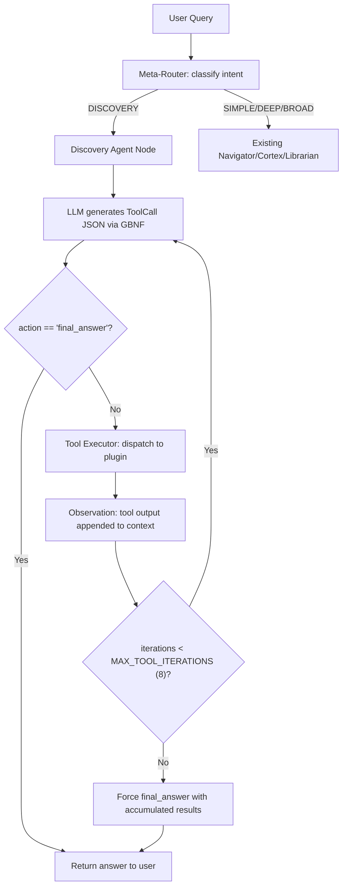

# Atlas Conversion Plan: Deterministic Discovery OS

> **Goal:** Transition Atlas from a text-reflecting RAG chatbot into a **closed-loop Discovery OS** where the LLM reasons and routes, but all scientific computation is performed by deterministic, auditable tools.

**Version:** 2.0 | **Date:** February 2026 | **Hardware Target:** RTX 3060/3070 production (RTX 3050 dev)

---

## 1. Why This Architecture Is Novel

No existing system combines all three of these properties:

| Property | ChemCrow | Coscientist | Schrödinger | **Atlas** |
|---|---|---|---|---|
| Local-first, zero-cloud required | ❌ GPT-4 only | ❌ GPT-4 only | ❌ SaaS | ✅ |
| Persistent knowledge graph across experiments | ❌ Stateless | ❌ Stateless | ❌ | ✅ Qdrant + Rustworkx |
| Closed-loop feedback (synthesis → NMR → assay → iterate) | ❌ | Partial | ❌ | ✅ |
| Open plugin ecosystem | ❌ Hardcoded tools | ❌ | ❌ Proprietary | ✅ SDK |
| Deterministic tools with ONNX CPU offload | ❌ | ❌ | ✅ Their own | ✅ Open-source stack |

**The core insight:** ChemCrow proved agentic tool-calling works for chemistry. Coscientist proved closed-loop lab execution works. But both **require GPT-4 cloud access** and are **stateless** — they don't remember prior experiments. Atlas is the first to combine agentic tool-calling, persistent synthesis memory, and local-first execution.

---

## 2. The Two-Layer Architecture

### Layer 1: Semantic Layer (LLM)
The LLM's **only jobs** are:
1. **Parse intent** — translate "find me a soluble binder for PDB:4XYZ" into structured constraints
2. **Select tools** — decide which deterministic tool to call next
3. **Explain results** — translate structured tool output back into human language

The LLM **never** generates SMILES strings, molecular weights, synthesis routes, or spectral interpretations. Those are always produced by deterministic code.

### Layer 2: Deterministic Layer (Plugins)
Isolated Python functions that:
- Take structured input (SMILES string, file path, numeric parameters)
- Run exact algorithms (RDKit, ONNX models, signal processing)
- Return structured output (JSON dicts with numbers, not prose)
- **Run on CPU** via ONNX Runtime — never compete with the LLM for GPU VRAM

---

## 3. Memory Budget & Hardware Strategy

### Why This Matters
The #1 failure mode of local AI chemistry systems is VRAM exhaustion. If ChemProp and the LLM both claim the GPU, inference crashes. This budget prevents that.

### RTX 3050 (4 GB VRAM) — Development

| Resource | VRAM | RAM |
|---|---|---|
| LLM (7B Q4_K_M, 35 layers offloaded) | ~3.2 GB | ~1.5 GB |
| Embedding model (nomic-embed-text-v1.5) | — | ~0.5 GB |
| **All deterministic plugins (ONNX, CPU-only)** | **0 GB** | **~0.5 GB** |
| Qdrant (embedded mode) | — | ~0.3 GB |
| Headroom | ~0.8 GB | — |

### RTX 3060/3070 (8–12 GB VRAM) — Production

| Resource | VRAM | RAM |
|---|---|---|
| LLM (8B–14B Q5_K_M, full offload) | ~5–8 GB | ~0.5 GB |
| Embedding model | — | ~0.5 GB |
| **Deterministic plugins (ONNX, CPU)** | **0 GB** | **~1 GB** |
| Qdrant | — | ~0.5 GB |
| Headroom for larger models | 2–4 GB | — |

**The iron rule:** Deterministic ML models (ChemProp, AiZynthFinder, NMR predictor) **always run on CPU via ONNX Runtime.** The GPU is exclusively reserved for the LLM. This eliminates VRAM contention entirely and is the same strategy AiZynthFinder v4+ adopted when they migrated from TensorFlow to ONNX.

---

## 4. The ReAct Tool-Calling Pattern

### Why Not LangGraph `ToolNode`

LangGraph's built-in `ToolNode` expects OpenAI-format `tool_calls` in `AIMessage` objects. This works perfectly with cloud APIs (GPT-4, Claude, DeepSeek) that natively emit structured `tool_calls`. But our local llama-cpp-python models emit **raw text** constrained by GBNF grammar — not OpenAI-format messages.

**Our solution:** A custom **ReAct Tool Executor** that works with both local GBNF output and cloud-native tool calling, using the same LangGraph `StateGraph` infrastructure we already have.

### The Tool Call Schema (GBNF-Constrainable)

```python
# This schema is passed to generate_constrained() via LlamaGrammar.from_json_schema()
TOOL_CALL_SCHEMA = {
    "type": "object",
    "properties": {
        "thought": {
            "type": "string",
            "description": "The agent's reasoning about what to do next"
        },
        "action": {
            "type": "string",
            "enum": ["predict_properties", "plan_synthesis", "verify_spectrum",
                     "search_literature", "final_answer"]
        },
        "action_input": {
            "type": "object",
            "description": "Arguments for the selected tool"
        }
    },
    "required": ["thought", "action", "action_input"]
}
```

This schema is **critical** because:
1. GBNF grammar guarantees the local 7B model outputs **valid JSON every time** — no parsing failures
2. The `enum` constraint on `action` means the model **cannot hallucinate tool names** — it can only select from the registered set
3. The `thought` field preserves chain-of-thought reasoning for auditability
4. When using cloud APIs, the same schema is sent as `response_format` for identical behavior

### The ReAct Loop



### Why ReAct Over Reflection

| Approach | What happens | Cost | Reliability |
|---|---|---|---|
| **Reflection** (current Navigator 2.0) | LLM writes a draft → LLM critiques its own draft → LLM rewrites | 3–6 LLM calls on *text* | Low — critiquing prose doesn't fix factual errors |
| **ReAct Tool-Calling** (this plan) | LLM selects a tool → tool returns deterministic result → LLM reasons about result | 1 LLM call + 1 tool call per step | High — each step produces verifiable data |

ReAct is faster (fewer LLM calls), more reliable (tool outputs are ground truth), and more auditable (every step has a `thought` and a deterministic `observation`).

---

## 5. Plugin Architecture & Lifecycle Management

### The Plugin Manager

The critical missing piece from the prior plan. Heavy ML models can't all be loaded simultaneously. The `PluginManager` handles lazy loading and memory management:

```python
class PluginManager:
    """Manages lifecycle of deterministic ML plugins.

    All plugins run on CPU via ONNX Runtime. Models are lazy-loaded
    on first tool invocation and cached. Memory can be reclaimed
    by calling unload().
    """

    def __init__(self):
        self._plugins: Dict[str, BasePlugin] = {}
        self._loaded: Dict[str, Any] = {}  # name -> loaded model/session

    def register(self, name: str, plugin: BasePlugin):
        """Register a plugin (does NOT load the model yet)."""
        self._plugins[name] = plugin

    async def invoke(self, name: str, **kwargs) -> dict:
        """Lazy-load plugin if needed, then execute deterministically."""
        if name not in self._loaded:
            self._loaded[name] = await self._plugins[name].load()
        return await self._plugins[name].execute(self._loaded[name], **kwargs)

    def unload(self, name: str):
        """Free memory for a specific plugin."""
        if name in self._loaded:
            del self._loaded[name]

    def unload_all(self):
        """Free all plugin memory (e.g., between workflow phases)."""
        self._loaded.clear()
```

### Plugin Interface

Every deterministic tool implements this interface:

```python
class BasePlugin(ABC):
    """Base class for all deterministic plugins."""

    @abstractmethod
    async def load(self) -> Any:
        """Load model/data into memory. Called once, lazily."""
        ...

    @abstractmethod
    async def execute(self, model: Any, **kwargs) -> dict:
        """Run deterministic computation. Must return a dict."""
        ...

    @abstractmethod
    def input_schema(self) -> dict:
        """JSON Schema for the tool's expected input."""
        ...

    @abstractmethod
    def output_schema(self) -> dict:
        """JSON Schema for the tool's output."""
        ...
```

### Initial Plugin Set (Phase 1)

| Plugin | Wraps | Input | Output | Model Size |
|---|---|---|---|---|
| `predict_properties` | RDKit (no model) | SMILES string | `{MolWt, LogP, TPSA, HBD, HBA, QED}` | 0 MB (pure code) |
| `plan_synthesis` | AiZynthFinder v4 (ONNX) | SMILES string | `{routes: [{steps, reagents, predicted_yield}]}` | ~100 MB |
| `verify_spectrum` | nmrglue + scipy | Expected SMILES + `.jdx` file path | `{match_score: 0.0-1.0, peak_comparison: [...]}` | 0 MB (pure code) |
| `search_literature` | Existing Qdrant RAG | Natural language query | `{chunks: [{text, source, page, score}]}` | 0 MB (reuses existing) |
| `check_toxicity` | RDKit SMARTS patterns | SMILES string | `{alerts: [...], pains_hits: int, clean: bool}` | 0 MB (pure code) |

**Note:** 3 of 5 initial plugins require **zero ML model loading** — they're pure algorithmic Python (RDKit, nmrglue, scipy). This means the Phase 1 prototype works without downloading any new models. Only `plan_synthesis` requires the AiZynthFinder ONNX checkpoint.

---

## 6. The Universal Chemical State Object (UCSO)

### Design Decision: Full TypedDict (Not Pydantic-in-TypedDict)

LangGraph states are `TypedDict` objects that flow between nodes. Embedding Pydantic `BaseModel` instances inside a `TypedDict` creates serialization mismatches at node boundaries. We use **pure TypedDict with plain dicts** for the state and Pydantic only at API validation boundaries (FastAPI routes).

```python
class DiscoveryState(TypedDict, total=False):
    """State object for the Discovery workflow.

    This is the UCSO — every node reads from and writes to this structure.
    Plain dicts and lists only — no Pydantic models inside.
    """
    # --- User intent ---
    query: str
    project_id: str
    target_constraints: Dict[str, Any]
    # e.g. {"binding_target": "PDB:4XYZ", "min_solubility": 0.8, "max_toxicity": 0.2}

    # --- Tool calling state ---
    messages: List[Dict[str, Any]]
    # ReAct message history: [{"role": "assistant", "thought": ..., "action": ...},
    #                          {"role": "tool", "name": ..., "output": ...}]
    current_iteration: int     # 0-indexed, max MAX_TOOL_ITERATIONS
    available_tools: List[str] # Dynamic — changes per workflow phase

    # --- Accumulated scientific data ---
    candidates: List[Dict[str, Any]]
    # Each: {"smiles": str, "properties": dict, "synthesis_route": dict|None,
    #        "spectrum_match": float|None, "assay_result": dict|None}

    # --- Workflow tracking ---
    phase: str  # "hit_identification" | "structure_design" | "verification" | "testing" | "clinical"
    reasoning_trace: List[str]
    status: str  # "running" | "completed" | "error" | "awaiting_human"
```

### Dynamic Tool Availability (SOTA LangGraph 1.0 Feature)

The `available_tools` field changes based on the `phase`:

| Phase | Available Tools | Why |
|---|---|---|
| `hit_identification` | `predict_properties`, `search_literature`, `check_toxicity` | You can't verify NMR before you have a candidate |
| `structure_design` | `predict_properties`, `plan_synthesis`, `check_toxicity` | Candidate exists, now plan how to make it |
| `verification` | `verify_spectrum`, `predict_properties` | Researcher did synthesis, uploaded NMR/MS data |
| `testing` | `search_literature`, `predict_properties` | Biological assay results are being evaluated |

This prevents the LLM from calling `verify_spectrum` when no spectrum data exists — a failure mode that ChemCrow suffers from because it exposes all 18 tools at all times.

---

## 7. Integration Points With Existing Codebase

### What We Keep (Zero Rewrite)

| Component | File | Why it stays |
|---|---|---|
| Hybrid RAG pipeline | `retrieval.py` | Used as the `search_literature` tool |
| Knowledge graph | `graph.py` | Cross-experiment memory — our moat |
| Grounding Verifier | `grounding.py` | Still audits final natural-language answers |
| LLM Service | `llm.py` | `generate_constrained()` is the foundation for GBNF tool calling |
| Embedding service | `llm.py` | Used by both RAG and plugins that need similarity |
| Librarian (fast path) | `librarian.py` | SIMPLE queries still go here — no chemistry involved |
| Navigator/Cortex | `swarm.py` | DEEP/BROAD non-chemistry queries still use these |

### What We Add

| Component | File | Purpose |
|---|---|---|
| Plugin Manager | `src/backend/app/services/plugins/__init__.py` | Lazy-load/unload deterministic tools |
| Plugin base class | `src/backend/app/services/plugins/base.py` | `BasePlugin` ABC |
| Property predictor | `src/backend/app/services/plugins/properties.py` | RDKit wrapper |
| Retrosynthesis | `src/backend/app/services/plugins/retrosynthesis.py` | AiZynthFinder ONNX wrapper |
| Spectrum verifier | `src/backend/app/services/plugins/spectrum.py` | nmrglue + scipy wrapper |
| Toxicity checker | `src/backend/app/services/plugins/toxicity.py` | RDKit SMARTS alerts |
| Discovery state | `src/backend/app/services/agents/discovery_state.py` | `DiscoveryState` TypedDict + UCSO |
| Discovery graph | `src/backend/app/services/agents/discovery_graph.py` | LangGraph `StateGraph` for the ReAct loop |
| Tool call schema | `src/backend/app/services/agents/tool_schemas.py` | GBNF-constrainable JSON schemas |

### Meta-Router Update

```python
# In meta_router.py — add one new intent category:
# DISCOVERY - Query involves molecular design, synthesis, spectral analysis,
#             or any chemistry/biology workflow requiring deterministic tools
# Examples: "Find a soluble binder for X", "Analyze this NMR spectrum",
#           "Plan a synthesis route for SMILES:..."
```

The existing `route_intent()` function gets one new category. All other intents (`SIMPLE`, `DEEP_DISCOVERY`, `BROAD_RESEARCH`, `MULTI_STEP`) continue to work exactly as before. **Zero disruption to current functionality.**

---

## 8. Phased Implementation Roadmap

### Phase 1: Foundation (Weeks 1–3)
**Goal:** A working ReAct loop with one real tool (`predict_properties`) and the `search_literature` bridge.

- [ ] Create `plugins/` directory with `BasePlugin`, `PluginManager`, `properties.py`
- [ ] Create `discovery_state.py` with `DiscoveryState` TypedDict
- [ ] Create `tool_schemas.py` with `TOOL_CALL_SCHEMA`
- [ ] Create `discovery_graph.py` with the ReAct `StateGraph`
- [ ] Add `DISCOVERY` intent to `meta_router.py`
- [ ] Wire into `routes.py` so the frontend can trigger discovery workflows
- [ ] **Validation:** Ask "What are the properties of aspirin?" → agent calls `predict_properties("CC(=O)OC1=CC=CC=C1C(=O)O")` → returns MolWt: 180.16, LogP: 1.19

### Phase 2: Retrosynthesis (Weeks 4–6)
**Goal:** AiZynthFinder v4 ONNX integrated as a live plugin.

- [ ] Install `aizynthfinder` + download USPTO ONNX model (~100 MB)
- [ ] Create `plugins/retrosynthesis.py` wrapping AiZynthFinder's `AiZynthFinder` class
- [ ] Add `plan_synthesis` to `TOOL_CALL_SCHEMA` enum
- [ ] **Validation:** Ask "How would I synthesize ibuprofen?" → agent calls `predict_properties` then `plan_synthesis` → returns multi-step route with reagents

### Phase 3: Spectroscopy & Closed Loop (Weeks 7–10)
**Goal:** Researcher can upload NMR data and the agent verifies it.

- [ ] Create `plugins/spectrum.py` wrapping `nmrglue` for `.jdx` file reading + `scipy.signal` for peak detection
- [ ] Enable `verify_spectrum` tool in `verification` phase
- [ ] Implement phase transitions in `DiscoveryState` (agent advances from `structure_design` → `verification` when NMR file is uploaded)
- [ ] **Validation:** Upload a `.jdx` file for aspirin → agent compares predicted vs. observed peaks → returns match_score

### Phase 4: Feedback Loop & Memory (Weeks 11–14)
**Goal:** Experimental results are stored in the knowledge graph, creating synthesis memory.

- [ ] After verification, write results (SMILES, route, match score, assay data) as new nodes/edges in the Rustworkx graph
- [ ] Add `SynthesisAttempt` edge type to graph ontology
- [ ] When planning new syntheses, the retrieval tool automatically surfaces past results for similar structures
- [ ] **Validation:** Plan synthesis for molecule A, record failure at step 2, plan synthesis for structurally similar molecule B → the agent's `search_literature` tool surfaces the prior failure and avoids the same route

---

## 9. Why This Is SOTA (2026)

### vs. ChemCrow (EPFL, 2024)
ChemCrow proved ReAct + chemistry tools works, but:
- **Requires GPT-4** (cloud, $0.03/1K tokens, no local option)
- **Stateless** — no memory between sessions
- **All 18 tools exposed simultaneously** — the LLM frequently calls irrelevant tools
- **No closed-loop** — it plans synthesis but can't verify the product

Atlas fixes all four: local LLM, persistent knowledge graph, dynamic tool availability per phase, and NMR verification in the loop.

### vs. Coscientist (CMU, Nature 2023)
Coscientist proved autonomous lab execution works, but:
- **Requires GPT-4** and internet access for every step
- **Stateless** — each experiment starts from scratch
- **Hardware-coupled** — designed for specific robotic platforms

Atlas is hardware-agnostic (human does the wet lab, Atlas does the reasoning) and persistent (synthesis memory compounds over time).

### vs. AiZynthFinder (AstraZeneca, 2025)
AiZynthFinder is the best open-source retrosynthesis engine, but:
- **It's a standalone CLI tool** — no agentic integration
- **No NMR verification** — it plans routes but can't validate products
- **No property prediction** — routes are chemically valid but may produce impractical molecules

Atlas wraps AiZynthFinder as one plugin among many, gating it behind property-based filtering so it only plans routes for molecules that already pass drug-likeness criteria.

### The Compound Moat
Every experiment that flows through Atlas deposits data into the local knowledge graph:
- "Synthesis of X via route Y failed at step 3 due to steric hindrance"
- "NMR of compound Z showed 92% match, verified structure"
- "Compound W showed IC50 of 45 nM against target T"

This data is **never uploaded to any cloud.** It's embedded in the local Qdrant vectors and Rustworkx graph. After 6 months of use, an Atlas instance has a personalized synthesis memory that no competitor can replicate. Switching costs increase with every experiment. This is lock-in through accumulated intelligence, not through data hostage-taking.

---

## 10. Risk Analysis

| Risk | Probability | Mitigation |
|---|---|---|
| Local 7B model fails to reliably select correct tools | Medium | GBNF grammar constrains output to valid JSON with enum-restricted tool names. Few-shot examples in system prompt. Fallback to cloud API for complex multi-tool sequences. |
| AiZynthFinder ONNX model produces low-quality routes | Medium | Human-in-the-loop validation. All routes are ranked by predicted yield. Failed routes feed back into knowledge graph to avoid repetition. |
| NMR peak matching produces false positives | Low | Spectrum verification returns a confidence score (0.0–1.0), not a binary pass/fail. Threshold is configurable. Researcher always makes final call. |
| VRAM exhaustion on RTX 3050 during development | Low | All plugins run on CPU via ONNX Runtime. LLM is the only GPU consumer. Budget validated in Section 3. |
| Plugin execution blocks the async event loop | Low | All plugin `.execute()` methods run in `asyncio.get_event_loop().run_in_executor(None, ...)` — same pattern already used by `generate_constrained()` in `llm.py`. |
