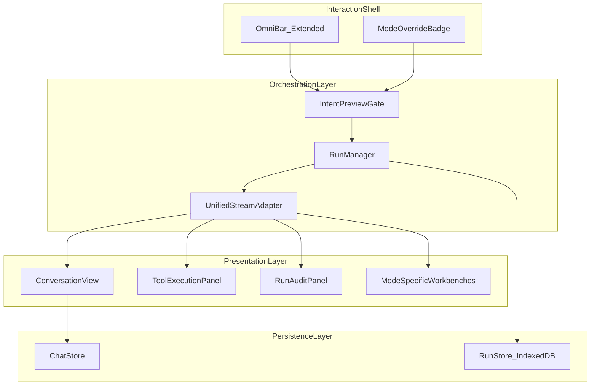
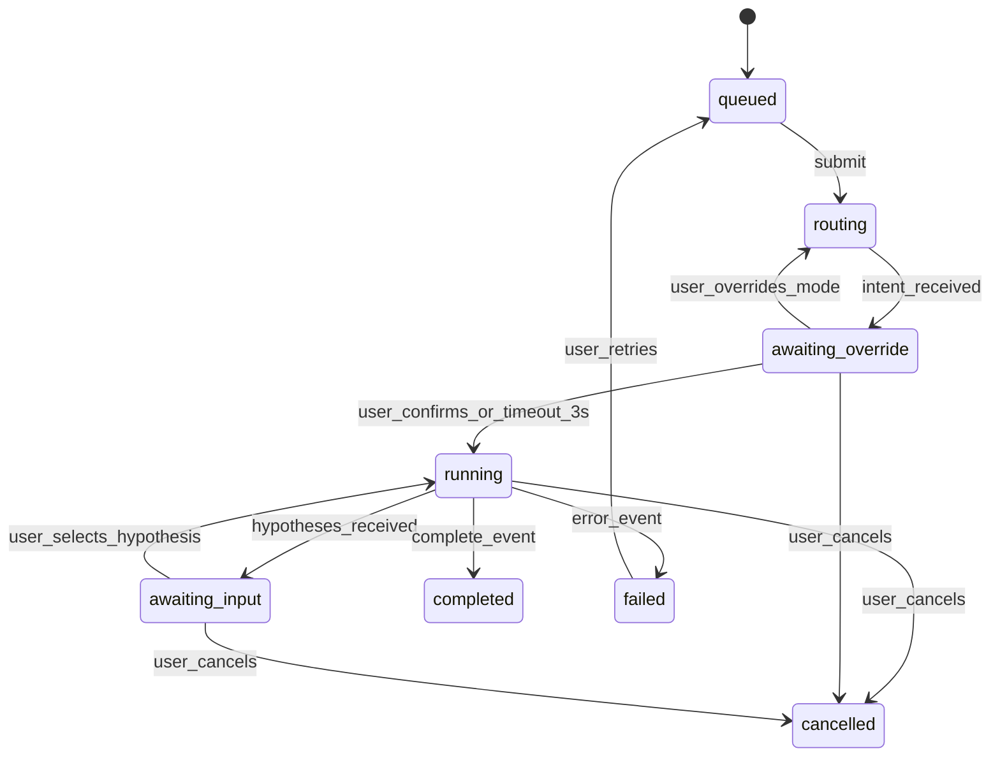

# Atlas Frontend Robustness Plan

**Version:** 2.0 | **Date:** February 2026 | **Scope:** No new features. Harden tool access, runtime behavior, and auditability.

---

## Decisions Locked

- **Interaction model:** Hybrid. Unified default workspace with auto-routing; advanced mode switcher preserved.
- **Auto-routing UX:** Backend meta-router classifies intent. Frontend shows user which mode was selected with option to override before execution starts.
- **Primary user:** Lab/professional. Auditability, reliability, reproducibility first.
- **Audit persistence:** Locally persisted (IndexedDB). Run history survives page refresh and app restart.

---

## Current-State Diagnosis (Code-Grounded)

### Problem 1: Monolith Component

`src/frontend/components/DualAgentChat.tsx` (1514 lines) owns eight distinct concerns:

- Mode tab switching (lines 956-997)
- Input control with mode-conditional placeholder and attachments (lines 1398-1491)
- Four separate API orchestration branches in `handleSubmit` (lines 298-864):
  - `librarian` branch: `api.chat()` (line 837)
  - `cortex` branch: `api.streamSwarm()` (line 405)
  - `moe` branch: `api.streamMoEHypotheses()` then `api.streamMoE()` (lines 504, 599)
  - `discovery` branch: `api.streamDiscovery()` (line 772)
- Streaming event interpretation with branch-specific switch statements
- Message rendering with generative UI parsing (lines 75-202)
- Side panel conditional rendering for AgentWorkbench and DiscoveryWorkbench (lines 1493-1510)
- Progress telemetry display (lines 1236-1348)

**Risk:** Any change to one concern can regress another. There are no interface boundaries between them.

### Problem 2: Four Divergent Streaming Protocols

`src/frontend/lib/api.ts` has four SSE stream methods with copy-pasted parsing logic:

| Method | Lines | Event Types Handled |
|---|---|---|
| `streamSwarm` | 844-916 | routing, progress, thinking, graph_analysis, evidence, grounding, chunk, complete, cancelled, error |
| `streamMoE` | 469-522 | routing, progress, thinking, evidence, grounding, chunk, complete, cancelled, error |
| `streamMoEHypotheses` | 524-577 | routing, progress, thinking, hypotheses, cancelled, error |
| `streamDiscovery` | 945-1016 | routing, progress, thinking, tool_call, tool_result, evidence, complete, cancelled, error |

Each repeats the same SSE buffer/parse/dispatch loop. Timeout, cancel, and error handling vary subtly between them.

### Problem 3: Tool Access Fragmented by Mode

Current tool affordances are mode-gated:

| Affordance | Available In | Hidden From |
|---|---|---|
| Spectrum file upload (.jdx) | Discovery only | Librarian, Cortex, MoE |
| Hypothesis selection cards | MoE only | All others |
| Agent telemetry side panel | MoE only | All others |
| Discovery OS telemetry + UCSO table | Discovery only | All others |
| Stop/cancel button | All (but only during loading) | — |
| Retry on failure | None (no retry exists) | All |

A lab user working across modes must discover per-mode controls from scratch each time.

### Problem 4: No Unified Run State

Current state model:

```
isLoading: boolean              // binary, no lifecycle
streamProgress: StreamProgress  // ad-hoc bag, nullable
streamingText: string           // separate from progress
startTime: number | null        // separate timer
elapsedSeconds: number          // derived, separate
```

There is no concept of a "run" as an entity. No run ID, no deterministic transitions, no failure categorization, no persistence.

### Problem 5: OmniBar is Navigation-Only

`src/frontend/components/OmniBar.tsx` (cmdk palette, Ctrl+K) currently only handles:
- View switching (document, editor, graph, chat)
- Upload trigger
- Export actions
- Navigation (back to dashboard)

It does not support query submission, mode selection, or tool invocation. It's a navigation palette, not a command surface.

### Problem 6: workspace-page.tsx Layout Coupling

`src/frontend/app/project/workspace-page.tsx` (694 lines) owns:
- 3-pane layout (library sidebar, main stage, context engine)
- 5 view tabs (document, editor, graph, chat, canvas)
- Chat is one of five views, accessed through the "Deep Chat" tab
- `chatMode` state lives here and is passed down to `DualAgentChat`
- `OmniBar` is mounted here but has no chat/query capabilities

The unified command surface needs to be accessible from any view, not only when the chat tab is active.

---

## Design Principles

1. **Operational clarity over novelty.** Every interaction makes current run state obvious.
2. **Single mental model for tool access.** Users never need to remember mode-specific affordances.
3. **Deterministic UI state transitions.** Finite lifecycle contract shared across all execution paths.
4. **Auditability by default.** Every tool invocation and result is traceable and reviewable.
5. **Graceful degradation.** Stream failure, timeout, and partial results degrade predictably with recovery paths.
6. **Progressive disclosure.** Default workflow stays simple; advanced controls remain available.

---

## Architecture Target



---

## Workstream 1: Unified Stream Adapter

### What It Replaces

The four copy-pasted SSE parsing loops in `api.ts`.

### Specification

One function signature:

```typescript
type NormalizedEvent =
  | { type: 'routing'; mode: string; intent: string }
  | { type: 'progress'; node: string; message: string }
  | { type: 'thinking'; content: string }
  | { type: 'tool_call'; tool: string; input: Record<string, any> }
  | { type: 'tool_result'; tool: string; output: Record<string, any> }
  | { type: 'evidence'; count: number }
  | { type: 'grounding'; claim: string; status: string; confidence: number }
  | { type: 'hypotheses'; items: any[] }
  | { type: 'graph_analysis'; data: any }
  | { type: 'chunk'; content: string }
  | { type: 'complete'; result: any }
  | { type: 'error'; message: string; category: FailureCategory }
  | { type: 'cancelled' };

type FailureCategory =
  | 'connectivity'
  | 'timeout'
  | 'stream_parse'
  | 'backend_validation'
  | 'backend_runtime'
  | 'user_cancelled';

function streamSSE(
  url: string,
  body: Record<string, any>,
  onEvent: (event: NormalizedEvent) => void,
  options?: {
    signal?: AbortSignal;
    timeout?: number;
  }
): Promise<void>;
```

The four existing methods (`streamSwarm`, `streamMoE`, `streamMoEHypotheses`, `streamDiscovery`) become thin wrappers that call `streamSSE` with the correct URL and body, then map any endpoint-specific event shapes into `NormalizedEvent`.

### Exit Criteria

- All four existing streaming flows use `streamSSE` internally.
- Timeout fires `{ type: 'error', category: 'timeout' }` instead of `reject(new Error('Stream timeout'))`.
- Cancellation fires `{ type: 'cancelled' }` consistently.
- Stream parse failures fire `{ type: 'error', category: 'stream_parse' }` instead of silent `console.error`.
- Zero behavior change visible to the user at this phase.

---

## Workstream 2: Run Manager and Run State Model

### What It Replaces

The `isLoading` boolean, `streamProgress` bag, `streamingText` string, `startTime`, and `elapsedSeconds` scattered across `DualAgentChat`.

### Run Object Specification

```typescript
interface Run {
  id: string;                        // crypto.randomUUID()
  mode: 'librarian' | 'cortex' | 'moe' | 'discovery';
  intent: string;                    // from meta-router or manual selection
  query: string;
  projectId: string;
  status: RunStatus;
  startedAt: number;
  completedAt: number | null;
  events: NormalizedEvent[];         // full event stream
  toolInvocations: ToolInvocation[]; // extracted from events
  result: any | null;                // final response
  error: { message: string; category: FailureCategory } | null;
}

type RunStatus =
  | 'queued'
  | 'routing'
  | 'awaiting_override'    // user sees mode badge, can override
  | 'running'
  | 'awaiting_input'       // MoE hypothesis selection
  | 'completed'
  | 'failed'
  | 'cancelled';

interface ToolInvocation {
  tool: string;
  input: Record<string, any>;
  output: Record<string, any> | null;
  startedAt: number;
  completedAt: number | null;
  status: 'running' | 'completed' | 'failed';
}
```

### State Transitions



### Auto-Routing with Override

When a query is submitted from the unified surface:

1. Status transitions to `routing`.
2. Backend meta-router classifies intent (SIMPLE, DEEP_DISCOVERY, BROAD_RESEARCH, MULTI_STEP, DISCOVERY).
3. Frontend maps intent to mode:
   - SIMPLE -> librarian
   - DEEP_DISCOVERY -> cortex
   - BROAD_RESEARCH -> cortex
   - MULTI_STEP -> moe
   - DISCOVERY -> discovery
4. Status transitions to `awaiting_override`. A mode badge appears showing the selected mode with a 3-second auto-confirm countdown.
5. User can click the badge to override mode selection, which restarts from `routing` with the forced mode.
6. After 3 seconds or user confirmation, status transitions to `running` and the appropriate stream begins.

**Implementation note:** This requires a new lightweight endpoint `POST /api/route` that returns `{ intent: string }` without starting execution. The existing `route_intent()` in `meta_router.py` already does this classification. Wire it as a standalone endpoint.

### Persistence

Runs are persisted to IndexedDB via a `RunStore` (separate from `ChatStore`). Schema:

- `runs` object store, keyed by `id`, indexed by `projectId` and `startedAt`.
- Events array is stored inline (typical run: 10-50 events, ~5-20KB).
- Retention: last 500 runs per project, auto-pruned on write.

### Exit Criteria

- `isLoading`, `streamProgress`, `streamingText`, `startTime`, `elapsedSeconds` are replaced by `currentRun: Run | null` and `runHistory: Run[]`.
- Every run has a unique ID and full event history.
- Status transitions are enforced (no invalid transitions possible).
- Retry creates a new run with the same query and mode.

---

## Workstream 3: Unified Command Surface

### What Changes

`OmniBar` (currently `src/frontend/components/OmniBar.tsx`, 140 lines) is extended from navigation palette to query submission + tool invocation entry point.

### Specification

OmniBar gains a new command group: "Query" (appears first when text input looks like a question rather than a command).

User flow:
1. User presses Ctrl+K from any view (document, editor, graph, canvas, chat).
2. Types a query.
3. OmniBar shows a preview line: "Run as: [Cortex] (auto-detected)" with override options.
4. User presses Enter to confirm, or selects a specific mode.
5. OmniBar closes. If not already on the chat view, workspace switches to chat view automatically.
6. Run begins with the auto-routing flow from Workstream 2.

If already on the chat view, the existing inline textarea continues to work as it does today. OmniBar is the **cross-view** entry point, not a replacement for the chat input.

### What Does NOT Change

- The chat view's inline textarea remains the primary input when the user is already in chat.
- Mode tabs inside the chat view remain as advanced controls.
- The existing OmniBar navigation commands (view switching, upload, export) remain.

### Exit Criteria

- A user on the document view can press Ctrl+K, type a chemistry question, and land in the discovery chat with the run already executing.
- Auto-routing badge appears before execution starts.
- All existing OmniBar commands still work.

---

## Workstream 4: Component Decomposition of DualAgentChat

### Migration Sequence (Ordered by Safety)

Each step must pass its exit criteria before proceeding.

**Step 1: Extract `useRunManager` hook**

Move all orchestration logic from `handleSubmit` (lines 298-864) into a custom hook:

```typescript
function useRunManager(projectId: string) {
  return {
    currentRun: Run | null,
    submitQuery: (query: string, mode?: string) => Promise<void>,
    cancelRun: () => void,
    retryRun: (runId: string) => void,
    selectHypothesis: (hypothesis: string) => void,
  };
}
```

`DualAgentChat` calls `useRunManager` instead of containing the orchestration inline. All four API branches are inside the hook.

**Exit criteria:** DualAgentChat renders identically. `handleSubmit` is gone from the component body. All streaming behavior unchanged.

**Step 2: Extract `CommandSurface` component**

Move the input area (lines 1398-1491) into a standalone component:

```typescript
interface CommandSurfaceProps {
  onSubmit: (query: string) => void;
  onCancel: () => void;
  onRetry: () => void;
  currentRun: Run | null;
  mode: string;
  onModeChange: (mode: string) => void;
  attachments?: { spectrumFile: any; onUpload: () => void; onRemove: () => void };
}
```

Includes mode override badge, attachment controls, and run status display.

**Exit criteria:** Input area renders identically. Mode-specific attachment logic (spectrum upload) is passed as props, not hardcoded.

**Step 3: Extract `ConversationView` component**

Move message rendering (lines 1074-1233) into a standalone component:

```typescript
interface ConversationViewProps {
  messages: ChatMessage[];
  onCitationClick: (filename: string, page: number, docId?: string) => void;
  expandedTraces: Set<string>;
  onToggleTrace: (msgId: string) => void;
}
```

**Exit criteria:** Messages render identically. Generative UI parsing stays inside this component.

**Step 4: Extract `RunProgressDisplay` component**

Move the streaming progress block (lines 1236-1348) into a standalone component:

```typescript
interface RunProgressDisplayProps {
  run: Run | null;
}
```

Derives all display state from the `Run` object instead of from `streamProgress` + `streamingText` + `elapsedSeconds`.

**Exit criteria:** Progress display renders identically but reads from `Run` state.

**Step 5: Consolidate side panels**

The existing `AgentWorkbench` (MoE) and `DiscoveryWorkbench` (Discovery) remain as-is but receive their data from the `Run` object's `events` and `toolInvocations` arrays instead of from ad-hoc `streamProgress` props.

**Exit criteria:** Workbench panels render identically. Props are derived from `Run` state.

### Post-Decomposition File Structure

```
src/frontend/
  components/
    chat/
      ChatShell.tsx          // Layout, mode tabs, side panel routing
      CommandSurface.tsx      // Input, attachments, mode badge, status
      ConversationView.tsx    // Messages, citations, generative UI
      RunProgressDisplay.tsx  // Progress telemetry during execution
    AgentWorkbench.tsx        // MoE side panel (unchanged externally)
    DiscoveryWorkbench.tsx    // Discovery side panel (unchanged externally)
  hooks/
    useRunManager.ts          // Orchestration, streaming, run lifecycle
  stores/
    chatStore.ts              // Messages and input (existing, minimally changed)
    runStore.ts               // Run history persistence (new, IndexedDB)
  lib/
    api.ts                    // Existing + streamSSE adapter
    stream-adapter.ts         // NormalizedEvent types + streamSSE function
```

---

## Workstream 5: Error Handling and Recovery

### Failure Taxonomy (User-Facing)

| Category | User Message | Next Action |
|---|---|---|
| `connectivity` | "Cannot reach the backend. Is the server running?" | Retry button |
| `timeout` | "The request took too long. The backend may be overloaded." | Retry button |
| `stream_parse` | "Received an unexpected response format." | Retry button + "Report bug" link |
| `backend_validation` | "The backend rejected the request: {detail}" | Edit query and resubmit |
| `backend_runtime` | "The backend encountered an error: {detail}" | Retry button |
| `user_cancelled` | "You stopped this run." | "Run again" button |

### Retry Contract

- Retry creates a new `Run` with the same `query` and `mode`.
- Retry is always available after `failed` or `cancelled` status.
- Retry button appears inline in the conversation where the error occurred.
- Retry from the run audit panel is also available.

### Fallback Contract

When SSE streaming fails (connection drops mid-stream):
1. Attempt non-streaming fallback (`api.runSwarm`, `api.runMoE`, `api.runDiscovery`) once.
2. If fallback also fails, transition to `failed` with `connectivity` category.
3. Partial streaming text (if any) is preserved in the run's events and shown to the user with a "(partial, connection lost)" badge.

### Exit Criteria

- Every failure shows a categorized message and a concrete next action.
- Retry works from both inline conversation and audit panel.
- No error path results in a silent failure or frozen UI.
- Streaming disconnect triggers fallback, not a blank screen.

---

## Workstream 6: Run Audit Panel

### What It Is

A panel (accessible from any completed or failed run) that shows the full event timeline for that run. This replaces the current "reasoning trace" expand/collapse with a richer, persistent view.

### Specification

- Accessed by clicking a "View Run Details" link on any assistant message.
- Shows: run ID, mode, intent, start/end time, duration, status.
- Shows: full event timeline (each `NormalizedEvent` as a timestamped row).
- Shows: tool invocations with input/output expandable.
- Shows: failure details if applicable.
- Persisted runs are browsable from a "Run History" command in OmniBar.

### What Does NOT Change

- The existing expandable reasoning trace on messages stays as a quick-view summary.
- The existing workbench side panels stay for real-time telemetry during execution.

### Exit Criteria

- Any completed run can be reviewed with full event history after page refresh.
- Run history is browsable and filterable by mode and status.
- Audit data survives app restart (IndexedDB).

---

## Rollout Sequence with Exit Gates

### Phase 0: Contract Definition (This Document)

**Exit gate:** This plan is approved and all decisions are locked.

### Phase 1: Stream Adapter + Run State Model

**Changes:**
- Create `src/frontend/lib/stream-adapter.ts` with `NormalizedEvent`, `FailureCategory`, and `streamSSE`.
- Refactor the four stream methods in `api.ts` to use `streamSSE` internally.
- Create `src/frontend/hooks/useRunManager.ts` with `Run` type and state machine.
- Create `src/frontend/stores/runStore.ts` with IndexedDB persistence.
- Add `POST /api/route` endpoint to `routes.py` (wraps existing `route_intent`).

**Exit gate:**
- All four streaming flows pass manual smoke test.
- Runs are persisted and visible in IndexedDB after page refresh.
- Cancel, timeout, and error produce categorized `NormalizedEvent`s.
- Zero visual change to the UI.

### Phase 2: Component Decomposition

**Changes:**
- Extract `useRunManager` hook (Step 1).
- Extract `CommandSurface` (Step 2).
- Extract `ConversationView` (Step 3).
- Extract `RunProgressDisplay` (Step 4).
- Wire workbench panels to `Run` state (Step 5).
- Create `ChatShell` as the new container.

**Exit gate:**
- `DualAgentChat.tsx` is replaced by `ChatShell.tsx` that composes the extracted components.
- All four modes render and behave identically to current state.
- Side panels (AgentWorkbench, DiscoveryWorkbench) display correctly.

### Phase 3: Unified Command Surface + Auto-Routing

**Changes:**
- Extend `OmniBar` with query submission and auto-routing preview.
- Add mode override badge to `CommandSurface`.
- Wire auto-routing through `POST /api/route` -> intent preview -> mode badge -> execution.

**Exit gate:**
- Ctrl+K from document view -> type chemistry query -> auto-routes to Discovery -> run executes.
- Mode badge appears with override option and 3-second countdown.
- All existing OmniBar commands still work.
- Existing inline chat input still works when on chat view.

### Phase 4: Error Handling, Recovery, and Audit

**Changes:**
- Implement failure taxonomy and user-facing error messages.
- Add retry on failed/cancelled runs.
- Add streaming disconnect -> non-streaming fallback.
- Add Run Audit Panel.
- Add "Run History" command to OmniBar.

**Exit gate:**
- Kill backend mid-stream -> fallback fires -> user sees partial result with recovery option.
- Retry creates new run with same query.
- Run audit panel shows full event history for any past run.
- Run history survives page refresh.

### Phase 5: Professional QA Gate

**Verification matrix — every cell must pass:**

| Check | Librarian | Cortex | MoE | Discovery |
|---|---|---|---|---|
| Tool discoverability from unified surface | Pass | Pass | Pass | Pass |
| Tool discoverability from inline chat | Pass | Pass | Pass | Pass |
| Auto-routing selects correct mode | Pass | Pass | Pass | Pass |
| Mode override works | Pass | Pass | Pass | Pass |
| Run status transitions are correct | Pass | Pass | Pass | Pass |
| Cancellation works mid-stream | Pass | Pass | Pass | Pass |
| Retry after failure works | Pass | Pass | Pass | Pass |
| Streaming disconnect triggers fallback | Pass | Pass | Pass | Pass |
| Run audit shows full event history | Pass | Pass | Pass | Pass |
| Run history persists across refresh | Pass | Pass | Pass | Pass |
| Side panel displays correctly | N/A | N/A | Pass | Pass |
| Hypothesis selection flow works | N/A | N/A | Pass | N/A |
| Spectrum upload works | N/A | N/A | N/A | Pass |
| No silent failures | Pass | Pass | Pass | Pass |

---

## Risks and Mitigations

### Risk: Auto-routing misclassifies intent

The meta-router is an LLM call (or keyword fast-path). It can be wrong.

**Mitigation:** The 3-second override window lets users correct before execution. The mode badge always shows what was selected. Override is one click. If the user frequently overrides, that's signal to improve the router -- not a UX failure.

### Risk: IndexedDB storage limits

Runs accumulate. Each run is 5-20KB. 500 runs per project = 2.5-10MB per project.

**Mitigation:** Auto-prune to 500 runs. Offer "Clear run history" in settings. IndexedDB storage limits are typically 50MB+ per origin. This is well within bounds.

### Risk: Component decomposition introduces regressions

Splitting a 1514-line component into 5+ modules.

**Mitigation:** Each extraction step has its own exit criteria requiring identical rendering. Steps are sequential, not parallel. Each step is independently testable before proceeding.

### Risk: Streaming adapter introduces latency

Adding a normalization layer between SSE events and the UI.

**Mitigation:** The normalization is a synchronous type mapping, not an async operation. Overhead is negligible (one object spread per event).

### Risk: Two input surfaces (OmniBar + inline) create confusion

Users might not know which to use.

**Mitigation:** They serve different contexts. Inline input is for when you're already in chat. OmniBar is for when you're reading a document or exploring the graph and want to ask something without navigating. Progressive disclosure: the OmniBar hint ("Ctrl+K to ask from anywhere") appears subtly in the chat empty state.

---

## Definition of Done

This redesign is complete when:
- A lab user can submit a query from any workspace view and get routed to the correct agent automatically.
- The user can see and override the routing decision before execution starts.
- Every run has a persistent, reviewable audit trail.
- Failures are categorized, explained, and recoverable.
- Tool access is consistent and discoverable regardless of which mode is active.
- The existing visual design is preserved. No cosmetic regression.
- All cells in the Phase 5 verification matrix pass.
